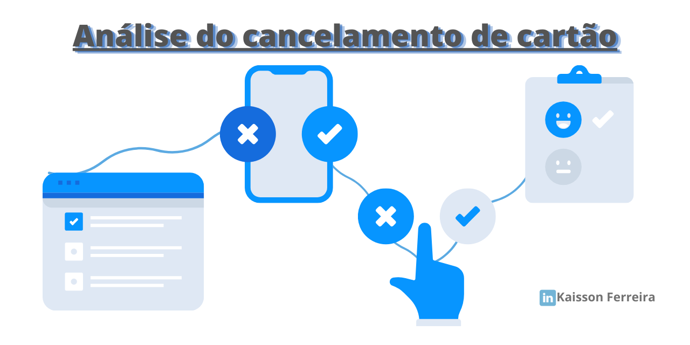

# Projetos básicos para o aprendizado
Nesse repositório, estão alguns projetos que fiz quando iniciei minha trajetória em Data Science. Então, eles foram feitos com a ajuda de alguns eventos, como por exemplo a Semana de Imersão de Dados da Alura e a Semana de Python realizada pela a empresa Hashtag. Entretanto, apesar te ter tido como base as aulas realizadas nesses eventos, os projetos foram remodelados e melhorados para que eu pudesse estar compartilhando por aqui, afim de dar um norte para aqueles que também estão começando. Dentro desses projetos de aprendizado, consegui aprender algumas bibliotecas como Pandas, matplotlib, seaborn, plotly e Scikit learn. Mas vale ressaltar que estou em **contínuo aprendizado** a cada projeto que faço, sempre querendo me aperfeiçoar e melhorar cada vez mais.

## Projeto 1:

O contexto de negócio desse projeto é o alcance de vendas a partir das publicidades em veículos de comunicação. O desafio proposto é entender qual veículo está mais propenso para alavancar as vendas, podendo assim tomar as devidas iniciativas. Nesse projeto foi realizado uma análise exploratória sobre os dados para verificar a correlação entre as vendas e os gastos em propagandas nos meios de comunicação (Tv, rádio e jornal). Após isso, foi avaliado qual algoritmo de Machine Learning que melhor previa essas vendas tomando como base os gastos em publicidade.

## Projeto 2:

O contexto de negócio desse projeto está inserido numa companhia prestadora de serviços em cartão de crédito. O desafio proposto é entender os motivos de cancelamento dos clientes, para que assim possam ser tomada as ações necessárias para amenizar essa situação. Assim, nesse projeto é realizado somente uma análise exploratorária (utilizando a biblioteca Plotly, que por sinal é bem interativa), sem a utilização dos recursos de Machine Learning. Entretanto, é observado que essas análises são suficientes para encontrar as causas raízes, podendo assim serem tomada as devidas iniciativas pelos gestores e outros colaboradores responsáveis. 
